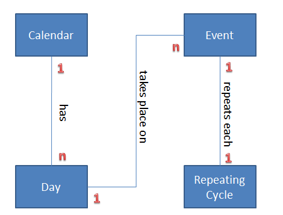
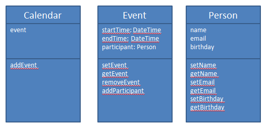

From the Lynda.com video series “Foundations of Programming: Object-Oriented
Design”, watch each (short) video and answer the correlating questions:

Section 0: Introduction
=======================
[0.1] What to expect from this course (3:06)
--------------------------------------------
What is the intended purpose and potential advantage of learning object oriented
design?

Leads to greater clarity in the code, enables to build better and complex applications

[0.2] Exploring object-oriented analysis, design, and development (1:41)
------------------------------------------------------------------------
Why might it be advantageous to analyze and design before beginning programming?

To develop good solutions, you need first to Understand (what) and Plan (How) before starting to Build. It’s a structured approach to drive from requirements to build. It’s also possible to split the Analysis, Design, and Build work between different team members.

[0.3] Reviewing software development methodologies (4:08)
---------------------------------------------------------
What is the difference between a "waterfall" and an "agile" approach to
development? What is an iteration and how do we to use them to build software?

“waterfall”: Complete each phase (planning, requirements collection, analysis, design, build, test, deploy) one after the other
“agile”: Supports continual development, multiple cycles (=iterations), each only taking days/weeks (not months). That way we are not running risk to identify wrong design (or even misunderstanding of requirements) only when the complete solution is build, but much earlier

Section 1: Core Concepts
========================
[1.1] Why we use object-orientation (2:42)
------------------------------------------
What are the various types of programming languages and in which domain is each
used?

“Object-Oriented”: The de-facto standard concept to develop commercial systems today
“Procedural”: classical programming languages (like COBOL, Fortran, PL/I), some still used as systems of the 70s/80s/90s had been written in such languages and still need to be maintained
“Logic”, “Functional”: academic purpose, focus on mathematics

[1.2] What is an object? (5:22)
-------------------------------
Describe in your own words the three properties of a computing object.

Identity: each object has a unique identification
Attributes: each object can hold data
Behavior: each object has methods/functions

[1.3] What is a class? (4:43)
-----------------------------
Explain how classes are analogous to blueprints. Include the relationship
between a class and an object. Can you think of how the analogy breaks down?

A Class describes what the object will be. It is like a blueprint. It can be defined once (it has to be defined first!), and then the class can instantiate an unlimited number of objects. Each class defines the type, attributes, and methods … so that way all objects instantiated will have the same capability, but each will have its unique state.
Classes are bundles in libraries/frameworks. That way we can leverage and reuse code.

[1.4] What is abstraction? (2:45)
---------------------------------
When a developer uses the term “abstraction” what are they describing?

Focus on essential qualities of a class that are relevant in the context of the targeted application.

[1.5] What is encapsulation? (3:45)
-----------------------------------
What does encapsulation prevent? What does it enable?

Data and information hiding. Only reveal to the outside what is required. It prohibits access to data/methods that are not intended to be modified/used in other ways than thru the exposed methods. It allows us to modify the inside of a class … as long as we keep to interface/signature unchanged, we can evolve the solution inside.

[1.6] What is inheritance? (3:35)
---------------------------------
Describe the inheritance relationship between classes. When would this
relationship be advantageous to establish?

Key idea is code reuse. Base/extend a class from on another class. The subclass inherits attributes and methods from the super-class, and can extend it with more attributes and methods.

[1.7] What is polymorphism? (3:22)
----------------------------------
What is the basic idea behind polymorphism? How can it make the classes we
create more flexible?

Override the inherited method in the subclass. This enables to build flexibility in the solution, so that you can have objects that have same signature, but depending from which specific class/type the object is, the implementation of a method may vary.

Section 2: Object-Oriented Analysis and Design
==============================================
[2.1] Understanding the object-oriented analysis and design processes (4:13)
----------------------------------------------------------------------------
What are the steps of analysis that come before writing code for an application?
Why do you think these steps make writing the code easier?

1. Gather requirements
2. Describe the app
3. Identify the main objects
4. Describe the Interactions
5. Create a Class Diagram
 
It’s a structured way to determine the required classes as well as the expected behavior and data managed by each class. It will guide to write code matching the requirements.

[2.2] Defining requirements (6:09)
----------------------------------
What should you have after you've completed the first phase of defining your
requirements?

Gather the mandatory requirements (must haves). Be careful not to spend time on nice to haves. In agile development, we will extend capabilities thru iterations when required.
 
Basically we have 2 main categories of requirements:
Functional and non-functional requirements (help, legal, performance, support, security)
 
We can split up requirements a bit more into the following set of categories:
FURPS+: functional, usability, reliability, performance, supportability, +design +implementation +interface +physical requirements

[2.3] Introduction to the Unified Modeling Language (UML) (1:54)
----------------------------------------------------------------
What is UML? Why Is it useful to visualize your application before coding it?

UML: Unified Modeling Language
Simple graphical representation that helps understand classes and their relationship

Section 3: Utilizing Use Cases
==============================
[3.1] Understanding use cases (6:11)
------------------------------------
Write a use case for creating an event on your phone's calendar.

Title: Create Event
Actor: Person
Scenario:
1. Person to select a day on the calendar
2. Person to select a starting time on the day
3. Person to enter Event Description
4. Optionally Person to enter ending day and time
5. System validates time entered
6. System displays information to the Person in case another event already logged for same period
7. System displays newly generated event on calendar

[3.2] Identifying the actors (4:16)
-----------------------------------
Can you think of a use case for a mobile application in which the actor is not
the user of the mobile device?

Actor could be an external system communicating via Blue Tooth LE.

[3.3] Identifying the scenarios (5:07)
--------------------------------------
Write another use case for a mobile device user interacting with a calendar
application. This time include a couple extensions when crafting your scenario.

Title: Create Reminder for repeating events
Actor: Person
Scenario:
1. Person to enter Event Description
2. Person to select a repeating cycle in months from list (every 1,2,3,4,5,6,8,12,18,24,30,36 months)
3. Person to select a starting month on the calendar
4. System validates month entered
5. System displays newly generated event on calendar
 
Extensions:
'#1: Person to switch repeating cycle unit
(A) into months
(B) into years
'#2: Selected month is in the past
(A)   User confirms to generate event that starts in the past
(B)   User discards creation of event

[3.4] Diagramming use cases (4:18)
----------------------------------
Do a google image search for "use case diagram." Notice how many variations
there are. What do they all generally have in common?

Actor(s) with arrows pointing to Scenarios

[3.5] Employing user stories (3:43)
-----------------------------------
Write 5 user stories to describe a mobile user interacting with his or her maps
application.

As a user
I want see my current location
So that I see on the map where I am at the moment
 
As a user
I want search for a city by name
So that the I see on the map where the city is located
 
As a user
I want search by street name
So that I see on the map where the street is located
 
As a traveler
I want select 2 locations on the map
So that I get a route and distance information
 
As a user
I want to put pins with descriptions on the map
So that I can record and store references for a location

Section 4: Domain Modeling (Modeling the App)
=============================================
[4.1] Creating a conceptual model (1:59)
----------------------------------------
What’s your favorite color?

Red

[4.2] Identifying the classes (2:27)
------------------------------------
Identify the classes in the use case you constructed for a user interacting with
his or her calendar application in chapter 3.

Day
Calendar
Event
Repeating Cycle

[4.3] Identifying class relationships (2:38)
--------------------------------------------
Identify the relationships among the classes you found above. Create a
conceptual model where you diagram these relationships and then upload a picture
of your model below.

[4.4] Identifying class responsibilities (6:43)
-----------------------------------------------
Identify the responsibilities of the classes you found above. List them here.

Event: Set Description, Set Repeating Cycle
Day: Add Event
Calendar: Show Days

[4.5] Using CRC cards (2:49)
----------------------------
If you’d like, try creating CRC cards for the model you made above. There's no
need to respond here, just try it out and see if you like this form of
organization.

**ANSWER HERE… IF YOU LIKE**

Section 5: Creating Classes
===========================
[5.1] Creating class diagrams (6:11)
------------------------------------
Construct Class Diagrams for the classes you imagine exist in a twitter app, a
maps app, a calendar app, or any other app you would like to make. Do you find
that it is easier to come up with the attributes or with the behaviors? Why do
you think that is?

It’s hard to say what’s easier, but for me behavior is first and that drives required attributes.

[5.2] Converting class diagrams to code (4:57)
----------------------------------------------
How might the separation of interface and implementation in Objective-C be an
advantage when working with class diagrams?

Better maintainability. Decoupling implementation helps to reduce effort when code changes are required. Also supports implementation of same interface in multiple ways.

[5.3] Exploring object lifetime (5:55)
--------------------------------------
What are the constructors and destructors in Objective-C? Why do we use them?

Allocate memory: with “alloc”
Initialize the object state: with “init”
Destructor to indicate that object is no longer needed and memory can be reused: With “Dealloc” method, but with ARC model, this is no longer required
 

[5.4] Using static or shared members (5:22)
-------------------------------------------
Like the interest rate example in the video, give three additional examples of
data that would be the same for all instances of a class.

“numberOfOrders” attribute for an “Order” class
“defaultRepeatingCycle” attribute for an  “Event” class
“employeePurchasePrograms” attribute for an  “Employee” class (representing the list of available EPPs at the company for the employees)

Section 6: Inheritance and Composition
======================================
6.1 Identifying inheritance situations (6:49)
---------------------------------------------
Describe in your own words what inheritance is and how it is useful when
constructing classes.

Inheritance refers to “Is-a” relationship between classes. This helps to identify similar attributes and behaviors between such classes. Common attributes and methods belong to the super-class, and all sub-classes will inherit from the super-class. It’s also possible to override behavior in sub-classes.

[6.2] Using inheritance (2:43)
------------------------------
Referring to the apps on your phone, come up with three examples where you
believe methods are being inherited from superclasses and called by subclasses.

Example 1: “draw” method … to draw object on screen
Example 2: “convertFromCurrencyToCurrency” method … to convert amount between 2 currencies
Example 3: “getID” method … to get the unique ID of the object
